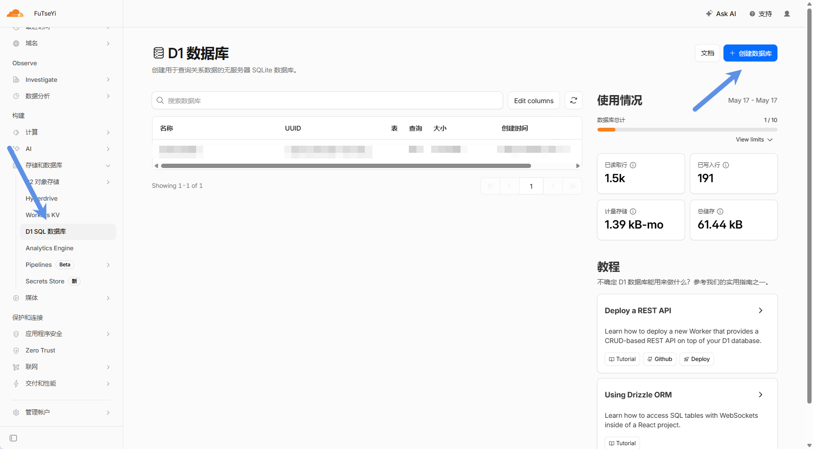
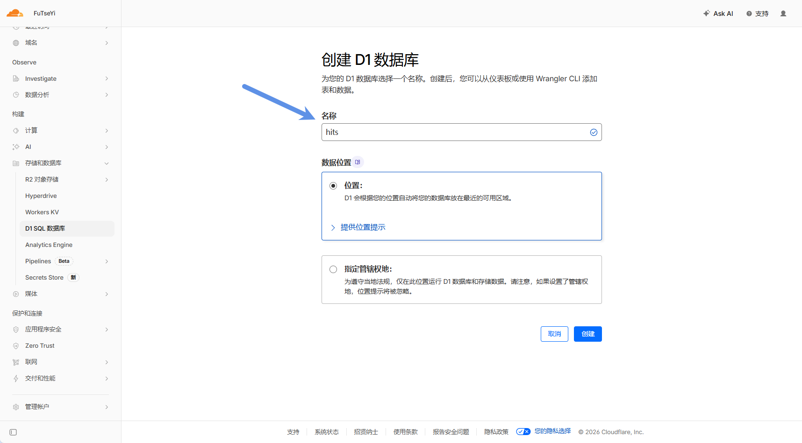
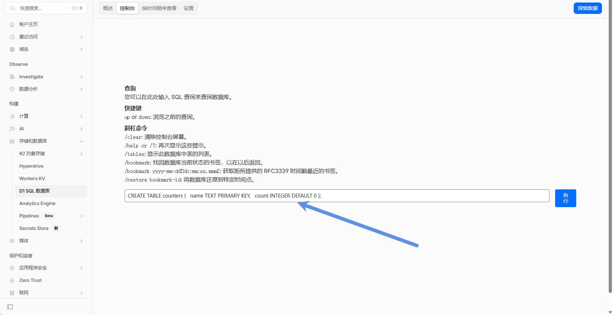
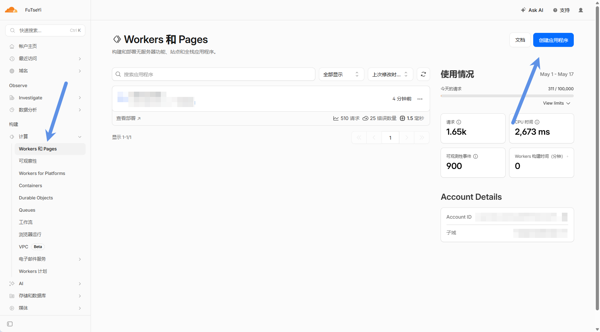
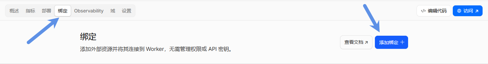
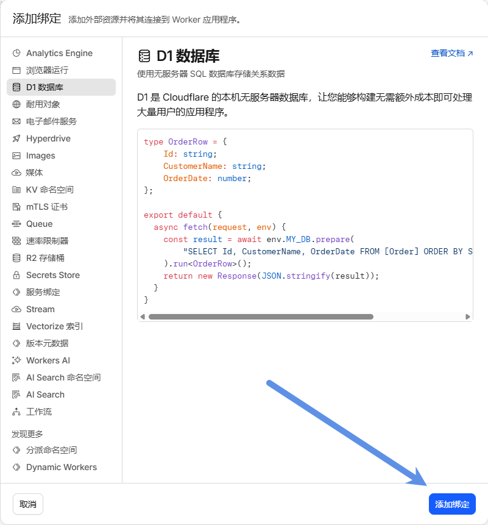
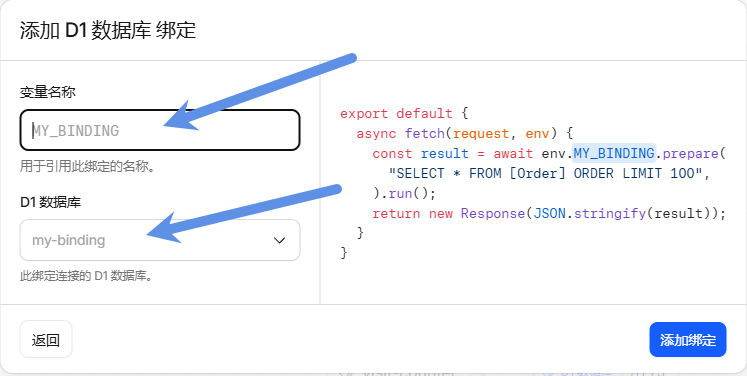
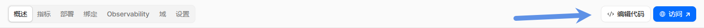
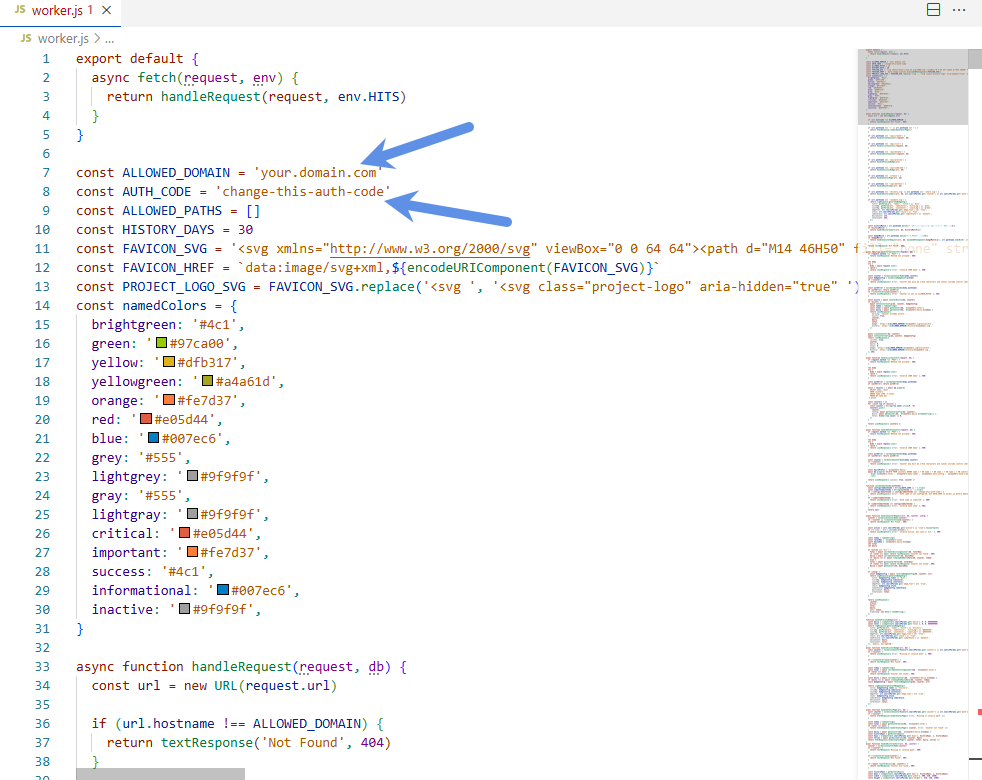
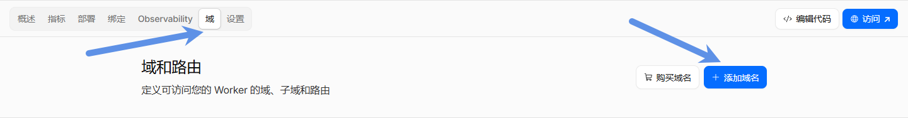

# Cloudflare-D1-Visit-Counter

<p align="center">
  
</p>

<p>
  <a href="https://github.com/FuTseYi/Cloudflare-D1-Visit-Counter"></a>
  
  
  
  
  <a href="LICENSE"></a>
</p>

<p align="center">
  <a href="https://visit.futseyi.com/status?path=https%3A%2F%2Fgithub.com%2FFuTseYi%2FCloudflare-D1-Visit-Counter">
    
  </a>
</p>

中文 | [English](README_EN.md)

**Cloudflare-D1-Visit-Counter** 是一个基于 **Cloudflare Workers + Cloudflare D1** 的开源、自托管访问量生成器。它不是依赖公共服务的普通访问徽章，而是完全部署在你自己 Cloudflare 账号下的 **GitHub README visitor badge / website visitor counter**：只需部署一次，就能通过唯一 `AUTH_CODE` 创建、维护和统一管理多个页面、多个项目、多个网站的访问计数器。

你可以用自己的域名生成 SVG 访问徽章、Markdown / HTML / Image URL、公开状态页和历史趋势图，数据保存在自己的 D1 数据库中，适合 GitHub README、个人主页、博客、文档站、项目主页和多页面站点长期使用。

## 快速开始

- [5 分钟部署🚀](#快速部署)
- [创建第一个访问徽章](#看板功能)
- [复制 Markdown / HTML / Image URL](#使用示例)
- [查看完整 API](docs/API.md)
- [了解安全与隐私](docs/SECURITY.md)

## 目录

- [Cloudflare-D1-Visit-Counter](#cloudflare-d1-visit-counter)
  - [快速开始](#快速开始)
  - [目录](#目录)
  - [为什么做这个项目](#为什么做这个项目)
  - [核心亮点](#核心亮点)
  - [适合场景](#适合场景)
  - [项目结构](#项目结构)
  - [工作逻辑](#工作逻辑)
  - [快速部署](#快速部署)
    - [1. 创建 D1 数据库](#1-创建-d1-数据库)
    - [2. 进入 Workers \& Pages](#2-进入-workers--pages)
    - [3. 先绑定 D1](#3-先绑定-d1)
    - [4. 创建并编辑 Worker 代码](#4-创建并编辑-worker-代码)
    - [5. 绑定自定义域名](#5-绑定自定义域名)
  - [看板功能](#看板功能)
  - [趋势数据保留](#趋势数据保留)
  - [使用示例](#使用示例)
    - [Markdown](#markdown)
    - [HTML](#html)
  - [更多文档](#更多文档)
  - [License](#license)

项目地址：[FuTseYi/Cloudflare-D1-Visit-Counter](https://github.com/FuTseYi/Cloudflare-D1-Visit-Counter)  
作者：[FuTseYi](https://github.com/FuTseYi)

## 为什么做这个项目

市面上的访问徽章项目通常只解决“显示访问量”这一个点，很多还依赖公共域名、公共数据库或第三方服务。这样虽然上手快，但长期使用时会遇到几个问题：数据不完全属于自己、服务可用性不可控、多个页面难以统一维护、别人可能随意构造 URL 污染统计。

`Cloudflare-D1-Visit-Counter` 的定位是：部署一次，就拥有一个完全属于自己的访问量生成器。你用唯一 `AUTH_CODE` 进入管理看板，按需为不同 README、网站页面、博客文章、文档页面或项目主页创建独立 counter；之后所有 counter 都可以在同一个 Dashboard 里加载、预览、复用、删除和维护。

它同时解决“生成访问徽章”和“长期管理访问计数器”两个问题：既能快速生成 Markdown / HTML / Image URL，又能保存徽章样式、管理已创建计数器，并为每个计数器自动提供公开状态页。核心目标是数据自有、一次部署、多用途复用、权限边界清晰和长期低成本运行。

## 核心亮点

| 能力                 | 本项目                                                              | 常见公开服务 / 简单开源计数器               |
| -------------------- | ------------------------------------------------------------------- | ------------------------------------------- |
| 完全自有             | 使用你自己的 Cloudflare Worker、D1、域名和数据表                    | 多数依赖公共服务域名，服务可用性不可控      |
| 一次部署，多用途复用 | 一个 Worker 可以服务多个 README、网站、博客、文档页面               | 常见方案更像单个 badge URL，后续管理能力弱  |
| 唯一密码启动和管理   | `AUTH_CODE` 保护 create / list / delete，只允许你创建和维护 counter | 很多 badge URL 可直接生成或缺少管理权限边界 |
| 防滥用               | 公开 badge URL 不会自动创建新 counter                               | 容易被随机 path 填充数据或污染统计          |
| 统一管理看板         | 可创建、加载、预览、复用、批量删除不同页面的 counter                | 常见方案只给 URL，没有完整管理面板          |
| 统计页               | 每个 counter 自动拥有公开 status page                               | 很多项目只返回 badge，没有可读状态页        |
| 样式保存             | 保存 Badge Label、颜色、样式、类型                                  | 重新生成时往往只靠 URL 参数                 |
| 数据隔离             | URL / counter key 是真实数据键，Badge Label 只是显示名              | 常见说明容易把显示名和数据键混在一起        |
| 中文支持             | counter key 支持中文、URL、页面名、仓库路径                         | 部分项目只推荐英文 keyword                  |
| 成本控制             | 单表 D1、无外部依赖、无静态资源请求、热路径极简                     | 有些方案需要额外服务、KV、Action 或外部托管 |
| 兼容性               | 同时保留 `/api/combined`、path-style SVG、JSON、history chart       | 很多项目只支持单一输出格式                  |

## 适合场景

- GitHub README 访问徽章
- GitHub 项目浏览量统计和 README view counter
- 个人主页、博客、文档站访问计数
- 项目页面访问量展示
- 多个网站、多个仓库、多个页面共用同一个自托管访问量生成器
- 多页面共用相同 Badge Label，但分别统计不同页面数据
- 想自己掌控域名、数据库、访问数据和部署成本的开源项目维护者

## 项目结构

```text
Cloudflare-D1-Visit-Counter/
├─ worker.js
├─ README.md
├─ README_EN.md
├─ LICENSE
└─ docs/
   ├─ API.md
   ├─ ARCHITECTURE.md
   ├─ SECURITY.md
   └─ ROADMAP.md
```

核心服务只需要 `worker.js` 即可运行，不需要构建工具、前端框架、npm 依赖或静态资源目录。

## 工作逻辑

本项目把“统计对象”和“徽章显示名”分开：

| 名称              | 作用                                         |
| ----------------- | -------------------------------------------- |
| URL / counter key | 真实数据键，决定哪个计数器和状态页被更新。   |
| Badge Label       | 只控制徽章上显示的文字，不影响统计数据归属。 |

例如你可以在不同页面都显示 `Visitors`，但每个页面使用不同 counter key：

| 页面        | Counter key                           | Badge Label | 统计数据   |
| ----------- | ------------------------------------- | ----------- | ---------- |
| 首页        | `https://example.com/`                | `Visitors`  | 首页访问量 |
| 博客        | `https://example.com/blog`            | `Visitors`  | 博客访问量 |
| GitHub 仓库 | `FuTseYi/Cloudflare-D1-Visit-Counter` | `Visitors`  | 仓库访问量 |

公开 badge URL 只会更新已经存在的 counter。你必须先通过看板或 `/api/create` 创建 counter，这样可以避免别人随便改 URL 就在你的 D1 里创建大量垃圾数据。总访问量永久保留；每日趋势数据按 `HISTORY_DAYS` 保留，用来控制 D1 存储增长。

## 快速部署

### 1. 创建 D1 数据库

在 Cloudflare Dashboard 左侧进入 **Storage & Databases -> D1 SQL Database**，点击 **Create database**。

<p align="center">
  
</p>

数据库名称可以填写 `hits`，也可以使用你自己的名称。后面绑定 Worker 时只需要选择同一个 D1 数据库即可。

<p align="center">
  
</p>

创建完成后，在 D1 Console 执行下面的 SQL 初始化表结构：

```sql
CREATE TABLE counters (
  name TEXT PRIMARY KEY,
  count INTEGER DEFAULT 0
);
```

<p align="center">
  
</p>

### 2. 进入 Workers & Pages

回到 Cloudflare Dashboard，进入 **Workers & Pages**，创建一个 Worker 服务。这里可以先使用默认模板进入 Worker 详情页，不急着粘贴 `worker.js`，下一步先完成 D1 binding。

<p align="center">
  
</p>

### 3. 先绑定 D1

在创建或编辑 Worker 的流程中，先进入 **Settings -> Bindings**，点击 **Add binding**。

<p align="center">
  
</p>

Binding 类型选择 **D1 database**。

<p align="center">
  
</p>

绑定配置按下面填写：

| Binding name | 绑定值         |
| ------------ | -------------- |
| `HITS`       | 你的 D1 数据库 |

这里的 `HITS` 必须保持不变，因为 `worker.js` 里会通过 `env.HITS` 访问数据库。D1 database 选择第 1 步创建的数据库，例如 `hits`。

<p align="center">
  
</p>

### 4. 创建并编辑 Worker 代码

进入 Worker 的代码编辑页面，把本仓库 `worker.js` 的完整内容复制进去。

<p align="center">
  
</p>

在 `worker.js` 顶部修改运行配置：

```js
const ALLOWED_DOMAIN = 'your.domain.com'
const AUTH_CODE = 'change-this-auth-code'
const ALLOWED_PATHS = []
const HISTORY_DAYS = 30
```

| 配置             | 必填 | 说明                                                                |
| ---------------- | ---- | ------------------------------------------------------------------- |
| `ALLOWED_DOMAIN` | 是   | 你的计数器域名，不带 `https://`。其他 Host 会返回 `404`。           |
| `AUTH_CODE`      | 是   | 创建、加载、删除 counter 的管理密钥，必须改掉默认值。               |
| `ALLOWED_PATHS`  | 否   | 留空表示允许所有已创建 counter；填入列表后只允许这些 counter key。  |
| `HISTORY_DAYS`   | 否   | 趋势图默认显示和 daily 明细保留天数。总访问量不受影响，会永久累计。 |

修改完成后点击 **Deploy** 发布 Worker。

<p align="center">
  
</p>

### 5. 绑定自定义域名

给 Worker 添加自定义域名，并确保域名和 `worker.js` 里的 `ALLOWED_DOMAIN` 完全一致。

<p align="center">
  
</p>

到这里部署已经完成。打开你的域名即可进入管理看板：

```url
https://your.domain.com/
```

输入 `AUTH_CODE` 后，就可以创建 counter、预览徽章，并复制 Markdown / HTML / Image URL 到 README 或网站中使用。

## 看板功能

看板负责创建、预览、生成链接和管理已有 counter。

| 字段             | 说明                                                          |
| ---------------- | ------------------------------------------------------------- |
| Auth Code        | 只有输入正确 Auth Code 才能创建、加载和删除。                 |
| URL              | 真实 counter key，可以是 URL、页面名、仓库路径或中文。        |
| Badge Label      | 徽章显示名，只影响展示文字。                                  |
| Label Background | 左侧背景色，默认 `#A4D3EE`。                                  |
| Count Background | 右侧计数背景色，默认 `#555555`。                              |
| Badge Style      | `flat`、`flat-square`、`plastic`、`for-the-badge`、`social`。 |
| Badge Type       | 默认 `today / total`，也可选 `total only`。                   |

## 趋势数据保留

只需要改一个配置：

```js
const HISTORY_DAYS = 30
```

它同时控制：

- 状态页默认展示天数。
- `/history/{counter}.svg` 默认展示天数。
- `?days=` 允许请求的最大天数。
- D1 中 daily 明细保留天数。

总访问量 `{counter}:total` 永久保留，不会被 daily 清理影响。把 `HISTORY_DAYS` 调大时，现有 daily 数据会继续保留，并从修改后逐步积累到新的天数；已经被清理掉的更早 daily 数据不会恢复。把它调小时，下一次访问触发清理后会删除超出范围的 daily 明细。

生成格式：

| 输出                 | 说明                      |
| -------------------- | ------------------------- |
| Markdown             | 只有徽章。                |
| Markdown with status | 徽章带 status page 跳转。 |
| HTML                 | 徽章带 status page 跳转。 |
| Image URL            | 纯 SVG 图片地址。         |
| Status page          | 公开统计页地址。          |

输出区支持两种模式：`Saved style` 生成稳定短链接，徽章样式从 D1 读取；`Custom URL` 生成带完整样式参数的链接，适合给某个页面单独美化。以后在看板重新编辑样式，已经嵌入网页的稳定短链接会自动使用新样式。

## 使用示例

### Markdown

```md

```

### HTML

```html
<a href="https://your.domain.com/status?path=https%3A%2F%2Fexample.com%2F" target="_blank" rel="noopener noreferrer">
  
</a>
```

## 更多文档

| 文档                                 | 内容                                          |
| ------------------------------------ | --------------------------------------------- |
| [API Reference](docs/API.md)         | Badge、status、management、legacy endpoints。 |
| [Architecture](docs/ARCHITECTURE.md) | D1 数据模型、热路径、低成本设计。             |
| [Security](docs/SECURITY.md)         | Auth Code、公开链接边界、隐私说明。           |
| [Roadmap](docs/ROADMAP.md)           | 后续计划。                                    |

## License

This project is licensed under the [MIT License](LICENSE).

